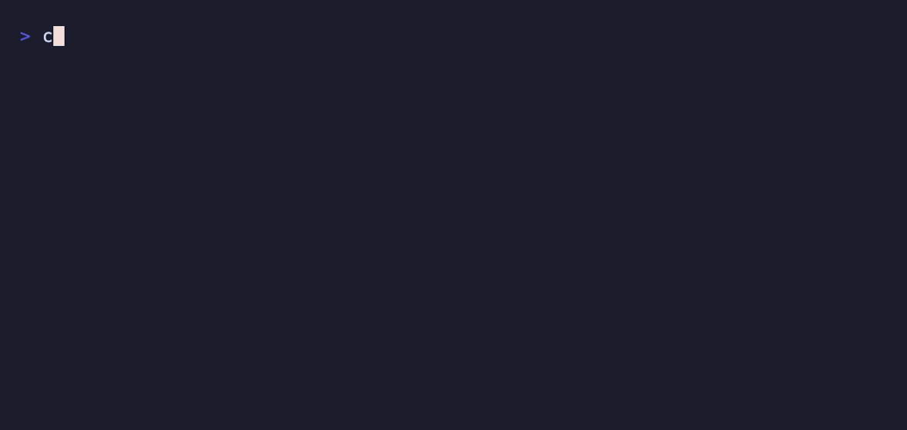

# fovea

Fixation-point reading for terminal output, built for the way AI agents actually
print things: streamed a token at a time, wrapped in ANSI colour, and full of
code that must not be touched.

```
fovea claude
fovea aider --model sonnet
git log | fovea --style dim-tail
```



`fovea` runs a command inside a pseudo-terminal and emphasizes the leading stem
of each word on its way to your screen. The wrapped program keeps a real tty, so
full-screen agent interfaces behave exactly as they do unwrapped.

## Why a wrapper

Every existing implementation of this technique assumes a finished string in a
browser. Agent output breaks all three of those assumptions, and a wrapper is
the only place to fix them once for every tool:

- **It streams.** Words arrive split across chunk boundaries. `fovea` holds back
  an incomplete tail and emphasizes the word once it is whole.
- **It is already styled.** SGR 22, which ends a bold stem, also clears dim.
  Emphasizing one word inside dim text would silently un-dim the rest of the
  line, so `fovea` tracks the active attributes and re-asserts them after every
  stem.
- **It is full of code.** `src/index.ts`, `--max-stem` and `camelCase` are left
  verbatim; emphasizing them is what makes naive implementations unreadable.

Because emphasis is added with escape sequences, which occupy no columns,
nothing the wrapped program printed changes width and its own layout
arithmetic stays correct.

Working with a tool that just pipes to stdout? `somecmd | fovea` needs no
pseudo-terminal at all.

## Install

```
npm install -g fovea
```

Node 18 or newer. The pty wrapper pulls in `node-pty`; if it fails to build,
piped mode still works.

## Options

| Flag | Default | Meaning |
| --- | --- | --- |
| `-s, --style` | `bold` | `bold`, `dim-tail`, or `both` |
| `-r, --ratio` | `0.4` | fraction of a word to emphasize |
| `-m, --max-stem` | `5` | cap on emphasized characters |
| `--min-word` | `2` | leave shorter words alone |
| `--stopwords` | off | skip common function words |
| `--locale` | `en` | locale for word segmentation |

`dim-tail` fades the back of each word instead of bolding the front. It reads as
less shouty on dense output, and on terminals whose bold is a brighter colour
rather than a heavier weight it is often the only one that works.

Everything after the first non-option argument goes to the wrapped command, so
its own flags need no escaping.

## Library

The transform is published separately from the CLI.

```js
import { toHtml, tokenize } from "fovea-core";

toHtml("Fixation points guide the eye");
// '<b class="fovea-stem">Fixa</b>tion <b class="fovea-stem">poi</b>nts …'
```

`tokenize` returns `{ text, kind, stem }[]` rather than a string, so one pass
over the text can feed a terminal, a DOM, or a Markdown file. `renderAnsi`,
`renderHtml` and `renderMarkdown` ship with it; anything else is a fold over the
same tokens.

For streams, `fovea-stream` exposes the chunk-safe transform the CLI uses:

```js
import { BionicTransform } from "fovea-stream";

const transform = new BionicTransform({ style: "dim-tail" });
process.stdout.write(transform.feed(chunk));
process.stdout.write(transform.flush());
```

## Does it make you read faster

Probably not. Controlled studies have generally found no reliable gain in
reading speed or comprehension against plain text, and the strongest honest
claim is that some people — including some dyslexic and ADHD readers — find it
more comfortable to stay with a long block of text.

That is worth building for on its own. It is not worth overselling, so this
project doesn't.

## Word segmentation

Word breaking goes through `Intl.Segmenter`, so accented and non-Latin
alphabetic scripts are handled properly rather than by an ASCII regex. Han,
Kana, Hangul and Thai are skipped deliberately: there is no leading stem to
emphasize in a logographic or abugida script, so the technique adds noise and
nothing else.

## Status

Early. The pieces below work and are tested; the rest is planned.

- [x] Core transform, ANSI / HTML / Markdown renderers
- [x] Streaming transform with SGR tracking
- [x] pty wrapper and pipe filter
- [ ] Markdown-aware fenced-code skipping
- [ ] Config file and per-agent profiles
- [ ] Browser extension
- [ ] React component

## Name

The fovea centralis is the pit in the retina responsible for sharp central
vision — the part of your eye a fixation actually lands on.

This project is not affiliated with, or derived from, any commercial product
implementing a similar technique.

## License

MIT
